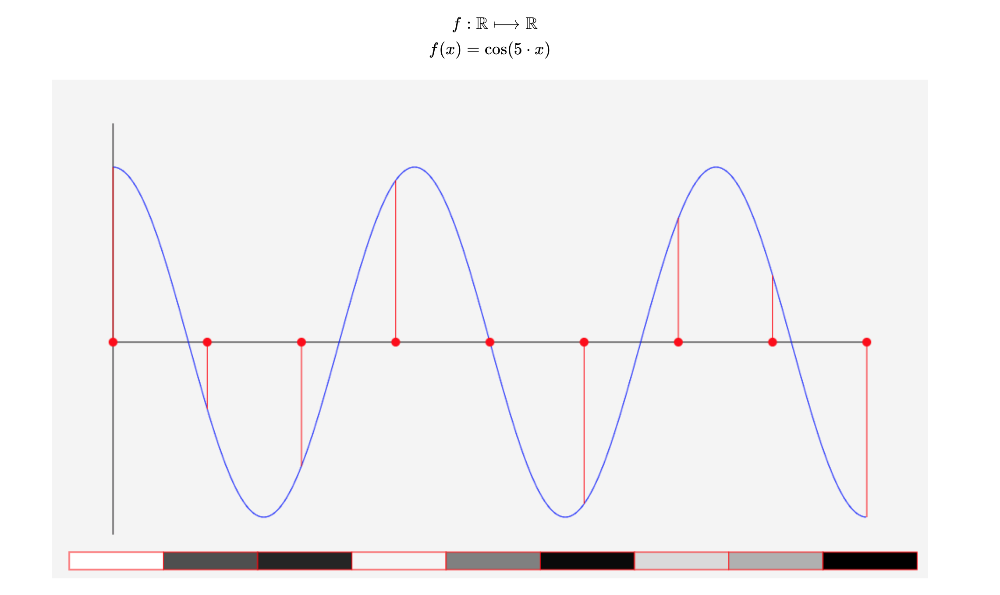
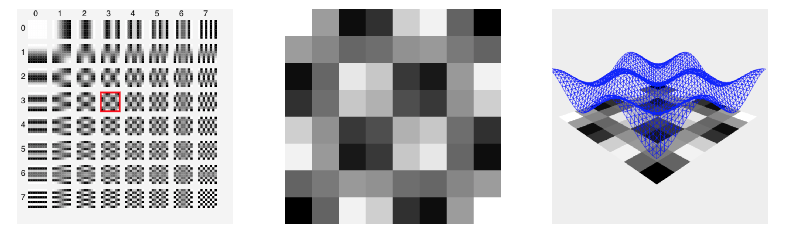

# jpeg format

this is the repo for a visual introduction to the jpeg format and the discrete cosinus.

## Requirements
You will need [node.js](https://nodejs.org/en/) at least version 14

## Getting started
To run the project from the terminal
```
git clone https://github.com/timHau/jpeg-vis.git
cd jpeg-vis
npm install
npm start
```

## Screenshots



## Inspiration
This project was written by me as part of the seminar data compression held during winter semester 2020/21 in Frankfurt.
A lot of the inspiration and the understanding comes from [Prof. Dr. Edmund Weitz](https://www.haw-hamburg.de/hochschule/beschaeftigte/detail/person/person/show/edmund-weitz/) who gave a [lecture](https://www.youtube.com/watch?v=7fhHQgu2OcY) on the discrete cosine. He also developed a [similar (awesome) webseite](http://weitz.de/dct/), which was a huge help and inspiration for me.