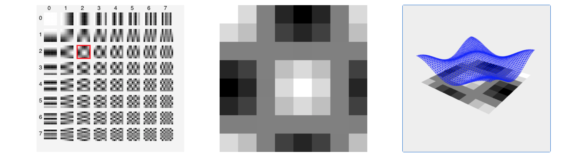

# jpeg format

this is the repo for a visual introduction to the jpeg format and the discrete cosinus.

## Requirements
You will need [node.js](https://nodejs.org/en/) at least version 14

## Getting started
To run the project from the terminal
```
git clone https://github.com/timHau/jpeg-vis.git
cd jpeg-vis
npm install
npm start
```

## Screenshots
